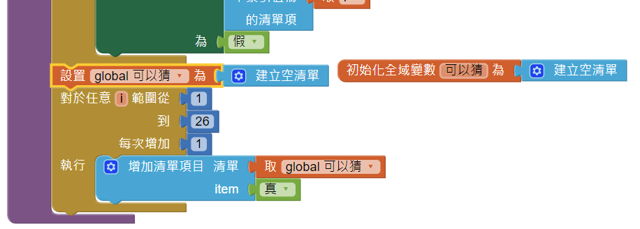
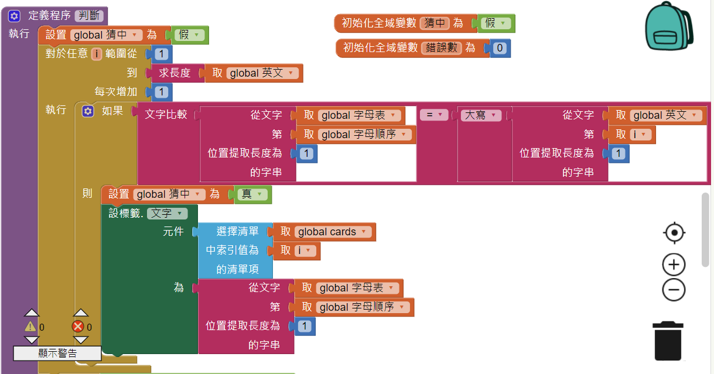
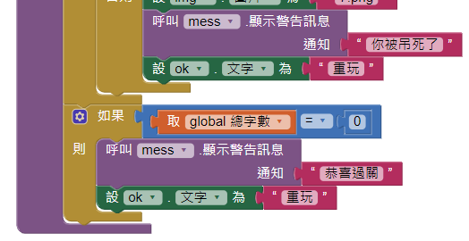
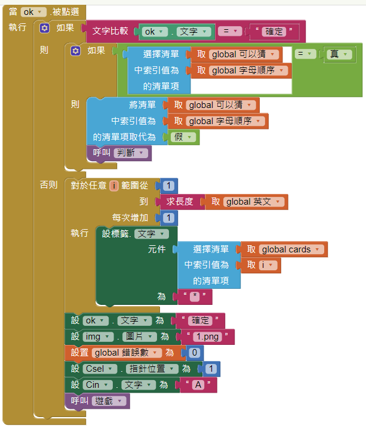

### HangMan App
1. 進入 AI2 ，新增一專案。可新增喜歡的背景圖。 
在屬性視窗，點[背景圖面] -> [上傳文件]，選擇下載的圖片，按確定即可。

2. 請將屬性中的 <標題> 改成 App 的作用。

3. 尋找要用的圖片 

### 主螢幕

4. 主畫面設計如下： 

5. 新增二個螢幕，分別是 Edit 及 Play。螢幕的布置與主畫面相同。 
   但在 Edit 螢幕中，將編輯單字按鈕的 "啟用" 屬性取消， 
   而在 Play 螢幕中，將進入遊戲按鈕的 "啟用" 屬性取消。

6. 在主畫面中輸入下列程式，在 Edit 螢幕中只要 "當 Play 被點選"， 
   而在 Play 螢幕中只要 "當 Edit 被點選" 的部分。 
   

### Edit 螢幕

7. 在 Edit 螢幕中，新增下列物件 
   
   
8. 在 Edit 螢幕的程式中，新增清單處理部分 
   

9. 將清單內容放入單字簿，進行下一次輸入。 
   

10. 在[清單顯示器] (Wordbook) 中增加修改的功能 
   

11. [OK] 按鈕的程式修改如下 
   

12. 從元件面板的 資料儲存區 中加入一個 [檔案管理] 物件，並將其命名為 "File"。 
    並加入下方的存檔程式。 
   
    
13. 最後，在進入時預設載入單字簿，程式如下 
   

### Play 螢幕

14. 在 Play螢幕中，新增下列吊人圖片及題目物件 
   
   
15. 在下面新增輸入字母及滑桿選字物件，滑桿作為選字之用，所以範圍設為1~26。 
   

16. 加入[對話框] 物件，命名為 mess，加入一個 [檔案管理] 物件，並將其命名為 "File"。

17. 加入滑桿程式如下  
   
   
18. 加入初始化開檔程式如下  
   

19. 加入遊戲的自訂程序如下  
   

20. 將所有卡片集合成一個清單 
   
   
21. 將10張字牌的文字均改成 * 號，在 Play 程序中加入，根據選中題目的長度留下對應的卡片，其餘的隱藏。  
   

22. 在 Play 程序中，重新設定26個字都是可以猜。  
   

23. 在選字過程中，依可以猜的真假值顯示不同顏色。  
   
   
24. 選定字母之後，將該字的可以猜設為假，不可再使用。同時呼叫判斷程序  
   

25. 判斷選中的字，如果存在，將該字的牌面顯示出來  
   

26. 根據錯誤次數，改變吊人的圖案  
   

27. 修改之前程式，紀錄所出的單字的字數。 
   
    
28. 修改判斷副程序，猜中將總字數減1。 
   

29. 在判斷中若全中則恭喜過關，將按鈕的字改成 "重玩"，重置圖片、錯誤數、選字機構、卡片文字。 
   
   
30. 修改 OK 按鈕，有選字及重玩兩種功能。重玩前將所有字卡設定為 * 號。 
   
   
