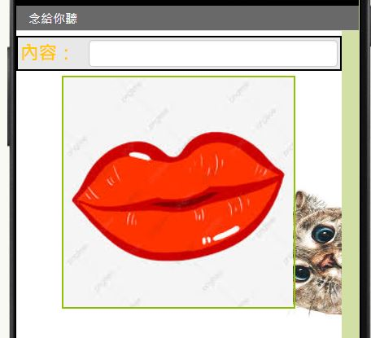
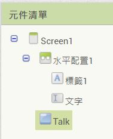
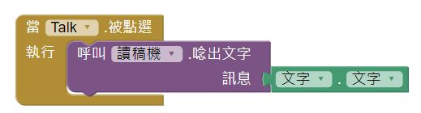

### Talk App
1. 進入 AI2 ，新增一專案。可新增喜歡的背景圖。 
在屬性視窗，點[背景圖面] -> [上傳文件]，選擇以下載的圖片，確定即可。

2. 請將屬性中的 [標題] 改成 App 的作用。

3. 新增一個 [水平配置] ，將寬度屬性設為填滿。 
    在水平配置裡面放入一個標籤及一個文字輸入盒。 
    標籤的文字屬性改成 "內容："，字體大小可適度加大。
   
4. 將文字輸入盒的字體加大，[提示]的字去掉，寬度填滿。
5. 新增一個按鈕，按鈕文字可改成 "唸出來" 或加入圖片。 
   可對桌面點一下，調整 [水平對齊] 屬性，讓按鈕置中。 

6. 新增一個 文字語音轉換器，將其重新命名為 "讀稿機"，將 文字輸入盒重新命名為 "文字"，將按鈕重新命名為 "Talk" 

7. 進入 [程式設計]，在按鈕(Talk)上點一下，選擇[當Talk被點選，執行..]，
8. 呼叫 (讀稿機) 將 (文字) 的內含文字念出。完成下方的程式。 

