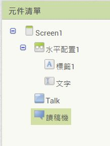

### Talk App
1. 進入 AI2 ，新增一專案。可新增喜歡的背景圖。 
在屬性視窗，點[背景圖面] -> [上傳文件]，選擇以下載的圖片，確定即可。

2. 請將屬性中的 <標題> 改成 App 的作用。

3. 新增一個 [水平配置] ，將 <寬度> 屬性設為填滿。 
    在 [水平配置] 裡面放入一個 [標籤] 及一個 [文字輸入盒]。 
    標籤的 <文字> 屬性改成 "內容："，<字體大小> 可適度加大。
   
4. 將 [文字輸入盒] 的字體加大，<提示> 裡面的字去掉，<寬度> 填滿。

5. 新增一個 [按鈕]，<文字> 可改成 "唸出來" 或加入圖片。 
   可對桌面點一下，調整 <水平對齊> 屬性，讓按鈕置中。 

6. 從 [多媒體] 群組中新增一個 [文字語音轉換器]，將其重新命名為 "讀稿機"， 
   將 [文字輸入盒] 重新命名為 "文字"，將 [按鈕] 重新命名為 "Talk" 

7. 進入 [程式設計]，在按鈕[Talk] 上點一下，拉出 [當Talk被點選，執行..] 程式塊。
8. 呼叫 [讀稿機] 將 [文字] 的內含文字念出。完成下方的程式。 

### 進階
1. 新增一個 [水平配置] ，將 <寬度> 屬性設為填滿。在 [水平配置] 裡面放入一個 [標籤] 及一個 [拉桿]。 
    [標籤] 的 <文字> 屬性改成 "音調："，<字體大小> 可適度加大。 
    [拉桿] 的 <寬度> 設為填滿， <最大值> 設為2，<最小值> 設為0，<指針位置> 設為1。
    
2. 新增一個 [水平配置] ，將 <寬度> 屬性設為填滿。在 [水平配置] 裡面放入一個 [標籤] 及一個 [拉桿]。 
    [標籤] 的 <文字> 屬性改成 "速度："，<字體大小> 可適度加大。 
    [拉桿] 的 <寬度> 設為填滿， <最大值> 設為2，<最小值> 設為0，<指針位置> 設為1。
3. 將 [拉桿1] 重新命名為 "音調"， [拉桿2] 重新命名為 "速度"。
4. 進入 [程式設計]，完成下面程式。 

