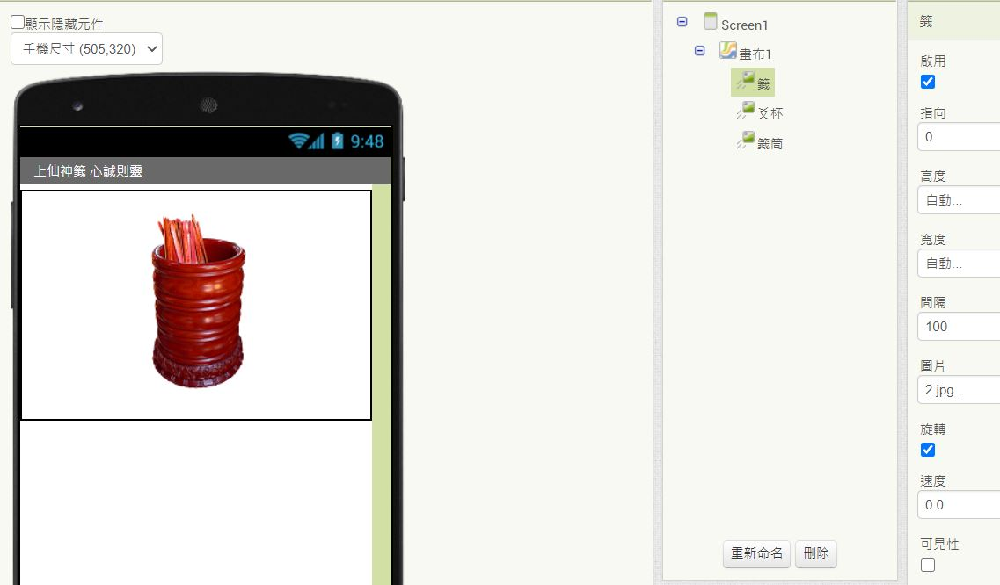

### Lottery App
1. 進入 AI2 ，新增一專案。可新增喜歡的背景圖。 
在屬性視窗，點[背景圖面] -> [上傳文件]，選擇以下載的圖片，確定即可。

2. 請將屬性中的 <標題> 改成 App 的作用。

3. 尋找要用的圖片，包含籤筒、單支籤、爻杯(三種) 

4. 新增一個 [畫布] ，將 <寬度> 屬性設為填滿， <高度> 屬性設為50%。 
    在 [畫布] 裡面放入一個 [圖像精靈]，在 <圖片> 屬性中傳入籤筒的圖。 
    若圖片過大可利用小畫家適度調整。
    
5. 再放入兩個 [圖像精靈]，第二個 <圖片> 屬性為單支籤，在第三個 <圖片> 傳三張爻杯圖片。

6. 將三個 [圖像精靈] 改名為 "籤筒"、"籤"、"爻杯"，把後兩個的 <可見性> 去掉，把 [籤筒] 移動中間。 
   

7. 放入一個  [按鈕] 改名為 "啟動"，文字改為 "搖籤筒"，位置放到中間。

8. 
